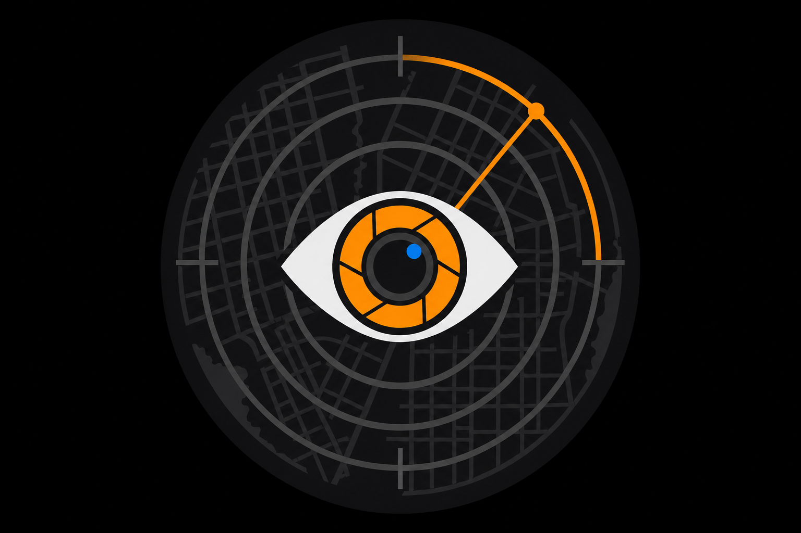
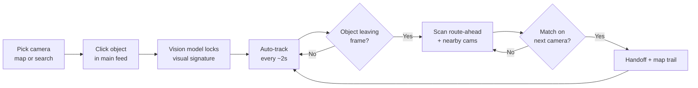
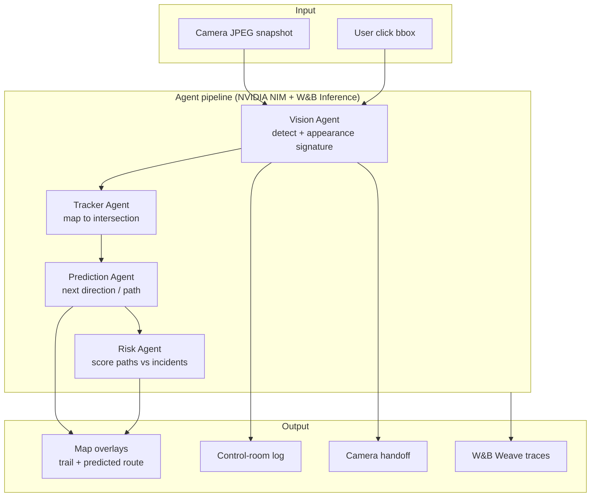
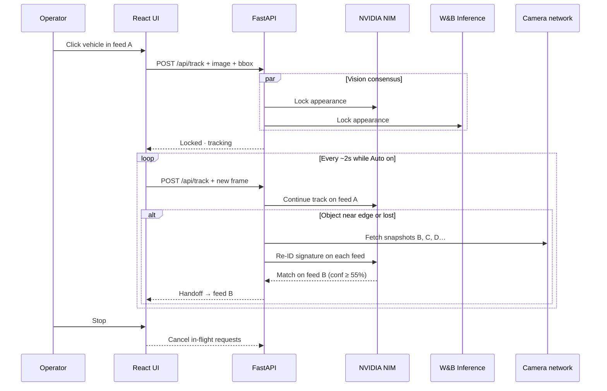

<p align="center">
  
</p>

<h1 align="center">TheWatcher</h1>

<p align="center">
  <strong>Live multi-camera tracking on NVIDIA NIM, W&amp;B Inference and CoreWeave</strong><br/>
  Click an object once — four AI agents follow it across a camera network in real time.
</p>

<p align="center">
  <a href="#quick-start">Quick Start</a> ·
  <a href="#how-it-works">How It Works</a> ·
  <a href="#sponsor-stack">Sponsor Stack</a> ·
  <a href="#use-cases">Use Cases</a> ·
  <a href="#architecture">Architecture</a>
</p>

---

## What is TheWatcher?

**TheWatcher** is a multimodal safety and tracking copilot. Operators pick a camera feed, click a vehicle or person, and the system:

1. **Locks** onto that exact object with a rich visual signature (color, clothing, plates, markings).
2. **Tracks** it frame-by-frame on the current camera.
3. **Predicts** where it is heading and draws the route on a live map.
4. **Searches** nearby cameras — and the camera ahead on the predicted path — to re-identify the same object.
5. **Hands off** automatically when the vision model confirms a match on the next feed.

| | |
|---|---|
| **Primary model** | NVIDIA Nemotron 3 Nano Omni on **NVIDIA NIM** |
| **Comparison model** | Gemma 4 31B on **W&B Inference** (CoreWeave GPUs) |
| **Observability** | **W&B Weave** traces every agent step and model call |
| **Input** | Live JPEG snapshots (Base64 multimodal) |
| **Agents** | Vision → Tracker → Prediction → Risk |
| **Cameras** | 900+ NYC DOT feeds or your own RTSP/JPEG endpoints |

---

## Sponsor stack

| Sponsor | What it does in TheWatcher |
|---|---|
| **NVIDIA** | NVIDIA NIM serves the primary vision model (`nvidia/nemotron-3-nano-omni-30b-a3b-reasoning`). It reads every camera frame, locks onto the clicked object, and runs the tracker, prediction and risk agents. |
| **Weights & Biases** | **W&B Inference** runs the comparison model (`google/gemma-4-31B-it`) side by side with NVIDIA, merges detections for a consensus result, and acts as a fallback. **W&B Weave** records every agent step — prompts, responses, latency, tokens, errors. |
| **CoreWeave** | W&B Inference runs on CoreWeave GPUs. [`deploy/coreweave/`](deploy/coreweave/) contains Kubernetes manifests to self-host the app and a Gemma vision model on a CoreWeave GPU node. |

---

## How it works

### Operator workflow



| Step | What you do | What happens |
|------|-------------|--------------|
| **1** | Select **7 Ave @ 34 St** (or any NYC DOT camera) | Map centers; nearby feeds load |
| **2** | **Click** a car or person in the main feed | The vision model builds an appearance signature |
| **3** | Leave **Auto** on — tracking runs every ~2s | Bounding box updates; log shows status lines |
| **4** | Watch the **map** | Blue trail = cameras visited; orange line = predicted route |
| **5** | Object exits frame | System searches the camera **ahead** on the heading **and** neighbors |
| **6** | Match confirmed | Feed switches; green badges on matched nearby cameras |
| **7** | Click **Stop** | All inference, handoffs, and logging halt immediately |

### Multi-agent pipeline

On a full **Scan**, four agents run in sequence on both models (NVIDIA NIM and W&B Inference) so the **Models** tab can compare them. The live **track** loop uses a fast path: dual-model vision plus geo handoff, with the remaining agents on the primary model only.



### Cross-camera re-identification



---

## Use cases

The core idea is the same everywhere: **many fixed cameras, one thing to find, agents that coordinate.**

### NYC traffic (demo)

- Click a taxi, van, or pedestrian on a live DOT feed.
- Follow it across intersections with map trail + route prediction.
- Risk agent weights paths using nearby 511NY incidents.

### Factory floor

| Watch for | How TheWatcher helps |
|-----------|----------------------|
| **Machine failure** | Click a robot arm, conveyor belt, or gauge once. Track abnormal motion or a part that stops moving; agents flag HALT when vision detects smoke, spill, or off-spec posture. |
| **Safety zones** | Track a forklift or worker near a restricted area. Prediction + Risk score whether they are heading into a hazard lane. |
| **Quality drift** | Lock onto a product on the line; re-ID the same unit across inspection cameras by color, label, or defect markers. |

### Hospital / ER

| Watch for | How TheWatcher helps |
|-----------|----------------------|
| **ER overcrowding** | Track bed occupancy and hallway congestion across ward cameras; Risk escalates when paths converge on triage. |
| **Equipment movement** | Click a crash cart or portable monitor; follow it across floors when cameras hand off by appearance. |
| **Abnormal events** | Vision describes posture and scene context (person on floor, crowd surge, unattended stretcher); log surfaces ALERT lines. |
| **Emergency routing** | Prediction draws where a gurney is likely heading; the next camera on the route is pre-scanned. |

*Factory and hospital modes:* set `mode: factory` / `mode: hospital` and point at your own camera IDs — no architecture change. No face recognition; generic object/pose language only.

---

## Architecture

```
┌─────────────────────────────────────────────────────────────────────────┐
│  frontend/          React + Vite + TypeScript + Leaflet (CARTO tiles)   │
│  ┌──────────┐  ┌─────────────────────┐  ┌─────────────────────────────┐ │
│  │ MapView  │  │ NearbyFeeds +       │  │ AgentChat + ComparisonView  │ │
│  │ trail +  │  │ SnapshotPanel       │  │ (log + NVIDIA vs W&B)       │ │
│  │ routes   │  │ click-to-track      │  │                             │ │
│  └────┬─────┘  └──────────┬──────────┘  └──────────────┬──────────────┘ │
│       └───────────────────┴────────────────────────────┘                │
│                                    │ /api/*                             │
└────────────────────────────────────┼────────────────────────────────────┘
                                     ▼
┌─────────────────────────────────────────────────────────────────────────┐
│  backend/           FastAPI (Python)                                    │
│  ┌─────────────┐  ┌──────────────────┐  ┌───────────────────────────┐   │
│  │ main.py     │  │ orchestrator.py  │  │ services/                 │   │
│  │ REST + JPEG │→ │ 4-agent pipeline │  │ nyc_data · detection ·    │   │
│  │ proxy       │  │ fast track path  │  │ multi_camera_track · route│   │
│  └─────────────┘  └────────┬─────────┘  └───────────────────────────┘   │
│                            │        tracing.py → W&B Weave              │
│                   ┌────────┴────────┐                                   │
│                   ▼                 ▼                                   │
│            NVIDIA NIM          W&B Inference (CoreWeave)                │
│            Nemotron Omni       Gemma 4 31B                              │
└─────────────────────────────────────────────────────────────────────────┘
                                     │
                                     ▼
                          NYC 511NY · OSRM routing · CARTO / OSM tiles
```

### Repository layout

| Path | Purpose |
|------|---------|
| `backend/app/agents/` | Prompts + orchestrator (Vision, Tracker, Prediction, Risk) |
| `backend/app/providers/` | OpenAI-compatible client for NVIDIA NIM, W&B Inference, CoreWeave |
| `backend/app/tracing.py` | W&B Weave tracing |
| `backend/app/services/` | Detection, geo handoff, nearby scan, NYC data |
| `frontend/src/components/` | Map, feeds, snapshot panel, agent log, model comparison |
| `deploy/coreweave/` | Kubernetes manifests for CoreWeave (app + GPU model server) |

---

## Quick start

> **`NVIDIA_API_KEY` is the only key needed for live inference.** Add `WANDB_API_KEY` + `WANDB_PROJECT` for the comparison model and Weave tracing.

### 1. Configure environment

```bash
cp .env.example backend/.env
```

```env
NVIDIA_API_KEY=nvapi-...             # https://build.nvidia.com
WANDB_API_KEY=...                    # https://wandb.ai/authorize
WANDB_PROJECT=<entity>/thewatcher
```

Map tiles need a CARTO basemaps key in `frontend/.env.local`:

```env
VITE_CARTO_KEY=...                   # https://carto.com/basemaps/apikey
```

### 2. Backend

```bash
cd backend
python -m venv .venv
source .venv/bin/activate          # Windows: .venv\Scripts\activate
pip install -r requirements.txt
python -m app.main                 # http://127.0.0.1:8000
```

Health check: [http://127.0.0.1:8000/api/health](http://127.0.0.1:8000/api/health) — both providers should show `"enabled": true` and `tracing.weave: true`.

### 3. Frontend

```bash
cd frontend
npm install
npm run dev                        # http://localhost:5173
```

Or build once and let the backend serve it: `npm run build`, then start the backend with `WATCHER_STATIC_DIR=../frontend/dist` and open http://localhost:8000.

### 4. Try it

1. Confirm the green **NVIDIA NIM** dot (and **Weave** badge) in the top bar
2. Pick **7 Ave @ 34 St** (recommended chip or search)
3. **Click** a vehicle or person in the main feed
4. Watch the log, map trail, and nearby camera matches update
5. Open the **Models** tab to compare NVIDIA NIM and W&B Inference per agent
6. Open your W&B project's **Weave** page to inspect every traced call

---

## API

| Method | Endpoint | Description |
|--------|----------|-------------|
| `GET` | `/api/health` | Provider status, model IDs, tracing status |
| `GET` | `/api/cameras` | All cameras (511NY or bundled samples) |
| `GET` | `/api/cameras/{id}/snapshot` | Proxied live JPEG (no CORS issues) |
| `POST` | `/api/watch` | Full 4-agent pipeline + dual-model compare |
| `POST` | `/api/track` | Fast live loop (vision consensus + multi-cam handoff) |
| `GET` | `/api/route` | Road-following polyline between two lat/lng points |

**Track request body (simplified):**

```json
{
  "camera_id": "uuid",
  "object_description": "clicked object — describe every visible detail",
  "bounding_box": { "x": 420, "y": 310, "width": 120, "height": 120 },
  "image_data_uri": "data:image/jpeg;base64,...",
  "mode": "nyc"
}
```

Bounding boxes use normalized 0–1000 coordinates.

---

## Environment reference

See [`.env.example`](.env.example) for the full list.

| Variable | Required | Purpose |
|----------|----------|---------|
| `NVIDIA_API_KEY` | Yes | Primary vision model on NVIDIA NIM |
| `NVIDIA_MODEL` | No | Default `nvidia/nemotron-3-nano-omni-30b-a3b-reasoning` |
| `NVIDIA_DISABLE_THINKING` | No | Default `true` — reasoning off for a fast tracking loop |
| `WANDB_API_KEY` | No | W&B Inference comparison model + Weave tracing |
| `WANDB_PROJECT` | No | `<entity>/<project>` for usage tracking and Weave traces |
| `WANDB_INFERENCE_MODEL` | No | Default `google/gemma-4-31B-it` |
| `PRIMARY_PROVIDER` | No | `nvidia` or `coreweave` (self-hosted endpoint) |
| `COREWEAVE_BASE_URL` | No | OpenAI-compatible endpoint on CoreWeave |
| `NY511_API_KEY` | No | Live NYC camera list + alerts |
| `VITE_CARTO_KEY` | No | CARTO basemap tiles (frontend) |

---

## Ethics & limitations

- **No face recognition or PII** — generic objects (vehicles, people-as-silhouettes, equipment) only.
- **Snapshot-based** — NYC DOT refreshes ~every 2s; not continuous video storage.
- **Probabilistic re-ID** — appearance matching across angles and lighting is scored with confidence; the UI shows percentages, not false certainty.
- Factory and hospital modes are **intended for simulated or consented deployments** — follow your organization's privacy and HIPAA policies.

NYC camera data is subject to NY DOT / 511NY terms of use.
