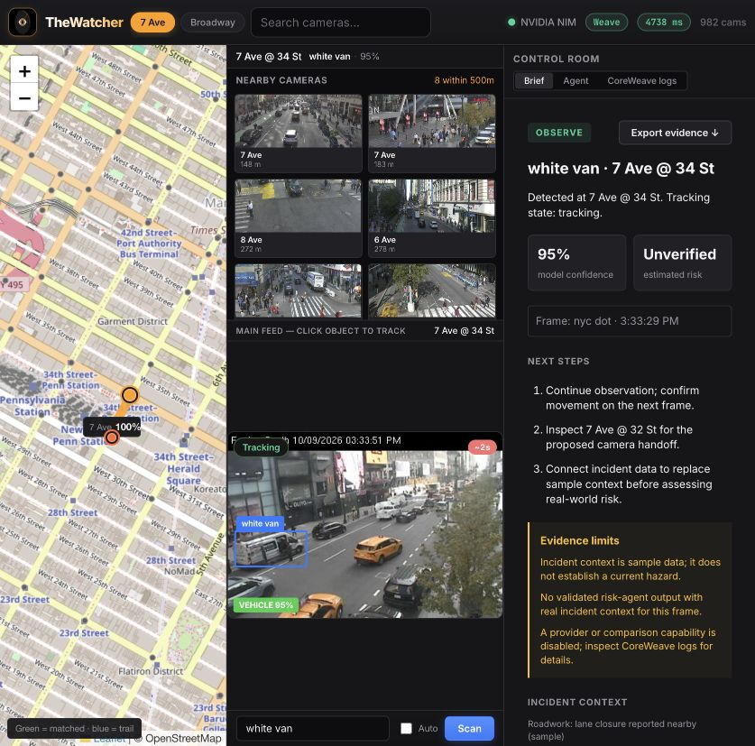
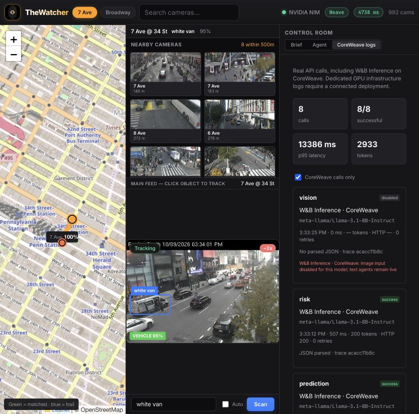
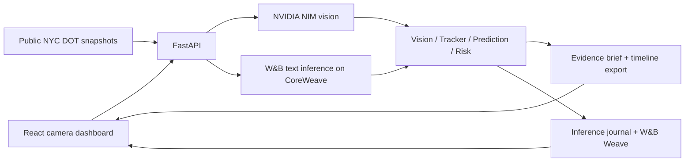

# TheWatcher

A camera operations copilot powered by NVIDIA NIM, W&B Inference and CoreWeave. Select a public NYC camera, click a target, and follow its visual appearance across nearby feeds. Turn observations into a source-labelled incident brief with recommended next steps and a downloadable evidence timeline.

## Run locally

Requires Python 3.11+ and Node 22.

```sh
cp .env.example .env
# Fill NVIDIA_API_KEY. Add WANDB_API_KEY and WANDB_PROJECT for comparison/traces.
python3.11 -m venv .venv
.venv/bin/python -m pip install -r backend/requirements.txt
cd backend
../.venv/bin/python -m uvicorn app.main:app --host 127.0.0.1 --port 8000
```

In another terminal:

```sh
cd frontend
npm ci
npm run dev -- --host 127.0.0.1
```

Open [the local dashboard](http://127.0.0.1:5173). Credentials belong only in the ignored `.env`; they are never bundled into the frontend. See `.env.example` for every supported setting.

## Vercel deployment

Deploy from the repository root. `vercel.json` uses [Vercel Services (beta)](https://vercel.com/docs/services) to build the Vite dashboard and Python 3.12 FastAPI backend together. `/api/*` reaches the backend on the same domain; all other paths serve the dashboard.

Set production environment variables on the Vercel project: `NVIDIA_API_KEY`, `WANDB_API_KEY`, `WANDB_PROJECT`, and the provider/model settings in `.env.example`. Store credentials as sensitive variables and keep them out of `VITE_*` variables. `.vercelignore` excludes local environment files and dependencies from uploads. Link the intended project explicitly before deploying:

```sh
vercel link --yes --scope <team> --project <project>
vercel --scope <team> deploy --prod
```

The inference journal is local to each running backend instance and resets on restart. Vercel can serve requests from different instances, so the journal is a recent operational view; exported browser timelines and W&B Weave traces preserve session evidence independently. API health, a live camera snapshot, and a full scan should be checked after deployment.

## Operator workflow

1. Select a camera from the map, search, or shortcut chips.
2. Enter an object description and **Scan** for the four-agent analysis, or click the object to start fast tracking.
3. **Auto** follows successive snapshots and searches nearby feeds when the target leaves view. Stop ends the tracking session; in-flight results are discarded.
4. Read **Brief** for confidence, data provenance, incident context, and next steps. “Verify” means evidence is incomplete; “Observe” continues monitoring; “Review” requests operator assessment of a model risk estimate supported by real incident context.
5. **Export evidence** downloads the latest brief and up to 60 session observations as JSON, including model outcomes, camera IDs, timestamped logs, and a SHA-256 fingerprint of each input image data URI. Exports do not contain camera pixels or API credentials. Camera selection starts a new timeline.
6. **CoreWeave logs** shows the last 250 inference outcomes in this server process: host, model, agent, latency, tokens, HTTP status, retries, JSON parsing, and request ID. Filter to CoreWeave-backed W&B calls. The journal resets when the server restarts.





## Architecture



The full Scan compares text agents and uses primary vision; the tracking loop uses one primary vision call plus targeted nearby-camera searches when needed. Camera positions come from the public camera metadata. Motion and route geometry are estimates rather than calibrated physical localization. Visual similarity is an AI hypothesis, requiring operator confirmation.

## Provider configuration

| Service | Purpose | Default model |
| --- | --- | --- |
| NVIDIA NIM | Primary vision and full-scan agents | `nvidia/nemotron-3-nano-omni-30b-a3b-reasoning` |
| W&B Inference | Text-agent comparison, on CoreWeave GPUs | `meta-llama/Llama-3.1-8B-Instruct` |
| W&B Weave | Agent/model traces with images omitted from inputs | `WANDB_PROJECT=<entity>/<project>` |
| CoreWeave endpoint | Optional self-hosted primary vision | `Qwen/Qwen2.5-VL-7B-Instruct` |

`PRIMARY_PROVIDER=auto` chooses NVIDIA if configured, then a dedicated CoreWeave endpoint. `SECONDARY_PROVIDER=auto` uses W&B; set `none` to disable comparison. `NVIDIA_DISABLE_THINKING=true` shortens the default reasoning model's responses. After two HTTP 503 overload responses, the last attempt uses `NVIDIA_FALLBACK_MODEL` (default: `meta/llama-3.2-11b-vision-instruct`); set it empty to disable fallback. Logs and model outcomes record the actual model used.

The default W&B model is text-only. `WANDB_VISION_ENABLED=false` prevents sending it unsupported image requests; skipped calls are labelled disabled in the journal. Enable image input only with a compatible model that your account can access. Check `/v1/models` at the provider to see currently available models.

No dedicated CoreWeave endpoint is required to use W&B Inference. The **CoreWeave logs** panel reports application-level inference outcomes; it does not claim to expose Kubernetes pod logs, GPU utilization, GPU temperature, or infrastructure billing. Connect your own CoreWeave deployment for infrastructure telemetry. [`deploy/coreweave/vision-gpu.yaml`](deploy/coreweave/vision-gpu.yaml) and [`watcher.yaml`](deploy/coreweave/watcher.yaml) are optional deployment templates requiring a registry image and cluster credentials.

## Data provenance

NYC DOT supplies camera lists and live JPEGs without a key. If the camera catalog is unavailable, clearly identified generated sample cameras are used. A failed live snapshot produces an unavailable-frame result rather than a generated frame presented as live. Client frames are labelled `client_frame`; sample camera frames keep their sample label even when sent from the browser.

`NY511_API_KEY` adds alerts; `SOCRATA_APP_TOKEN` adds historical crash context. Without usable incident sources the backend provides explicitly marked sample context. The brief never promotes sample context, fallback risk scores, malformed risk output, or fast-loop geometry into a verified risk assessment. Crash history is historical context, not proof of a present incident. Brief creation adds no model calls.

OpenStreetMap is the default map layer and requires no tile key. `VITE_GEOAPIFY_KEY` or `VITE_CARTO_KEY` switches providers at build time. OSRM supplies road-following route estimates with a straight-line fallback.

## API

| Method | Route | Result |
| --- | --- | --- |
| GET | `/api/health` | Configured providers and tracing availability; not a credential test |
| GET | `/api/cameras` | Available camera metadata |
| GET | `/api/cameras/{id}` | Camera metadata |
| GET | `/api/cameras/{id}/snapshot` | Proxied snapshot |
| POST | `/api/watch` | Full analysis, model outcomes, and evidence brief |
| POST | `/api/track` | Fast vision tracking, targeted handoff search, and brief |
| GET | `/api/telemetry` | Bounded metadata journal and summary |
| GET | `/api/route` | Road-following route coordinates |

Provider response keys are `primary` and `secondary`. Errors are summarized without returning upstream bodies or credential-bearing URLs. The journal stores no prompts or images. Configure access control before exposing the local development service to shared networks.

## Validation

```sh
PYTHONPATH=backend .venv/bin/python -m unittest discover -s backend/tests -v
npm run build --prefix frontend
```

The behavior suite covers source labelling, sample-data risk suppression, invalid risk JSON, credential-safe failure telemetry, provider success metadata, and the API-to-brief flow. Live provider tests are performed separately because they consume account quota. See [`docs/verification.md`](docs/verification.md) for the observed results from the local run.

## Container

```sh
docker build -t thewatcher .
docker run --env-file .env -p 8000:8000 thewatcher
```

The image builds the SPA and serves it from FastAPI. Set `PORT` for another deployment port. Templates are provided for CoreWeave Kubernetes; no cloud deployment is performed by the local startup commands.
